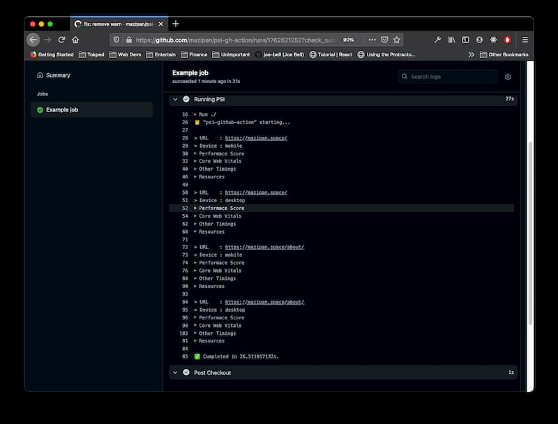

# 🐯 psi-gh-action

Github Action to generate web performance report using PageSpeedInsight

 



## Inputs

| Input       | Description                         | Required                  | Default |
| ----------- | ----------------------------------- | ------------------------- | ------- |
| `api_key`   | PageSpeedInsight API key            | yes                       |         |
| `urls`      | List of URL(s) to be analyzed       | yes                       |         |
| `devices`   | Device(s) used for test             | no                        | mobile  |
| `runs`      | Number of runs to do per URL        | no                        | 1       |
| `push_back` | Push JSON report to the main branch | no                        | false   |
| `token`     | Github token                        | yes (if `push_back` true) |         |
| `branch`    | Main branch to store report files   | no                        | master  |

## Example usage

```yaml
- name: psi-gh-action
  uses: mazipan/psi-gh-action@1.0.0
  with:
    api_key: ${{ secrets.PSI_API_KEY }}
    urls: |
      https://mazipan.space/
      https://mazipan.space/about/
      https://mazipan.space/talks/
    devices: |
      mobile
      desktop
    runs: 1
    branch: master
    push_back: true
    token: ${{ secrets.GITHUB_TOKEN }}
```

## Additional Resources
### How to add new secret in Github Actions

https://docs.github.com/en/actions/reference/encrypted-secrets

### How to create new API Key for PSI

https://developers.google.com/speed/docs/insights/v5/get-started

---

Code by @mazipan from 2021
