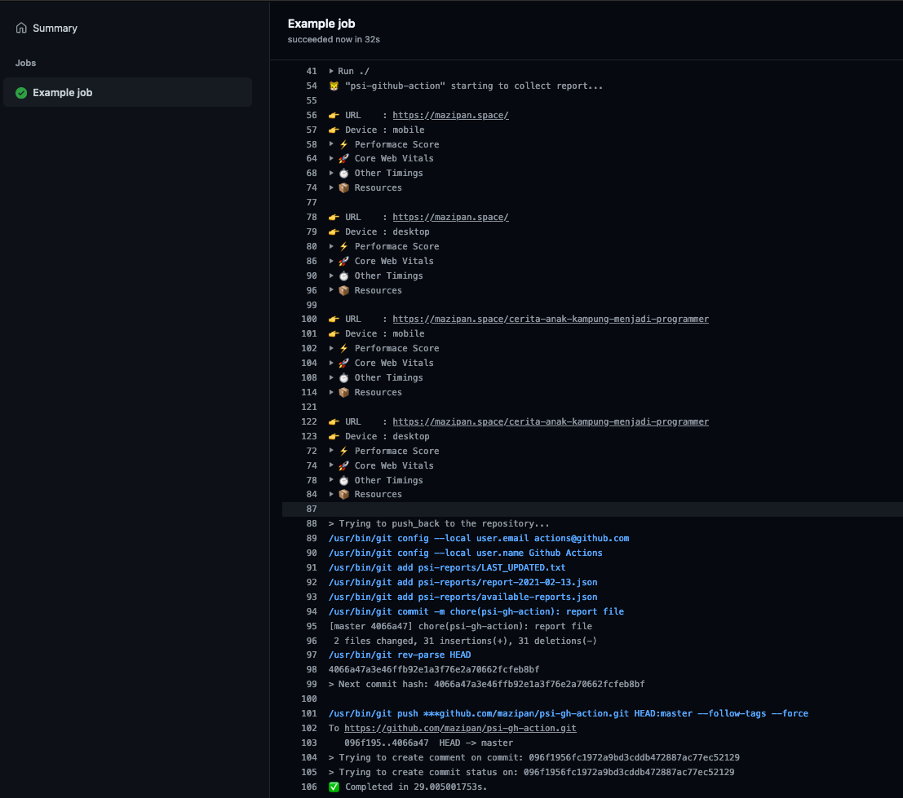

# 🐯 psi-gh-action

Github Action to generate web performance report using PageSpeedInsight

 



## Motivations

I want to create an open web performance report for my personal blog, I want my reader can access my web performance report as easy as they read my articles. That's why I build this Github Actions, so whenever I need to show web performance report in my open source project then I just need to using this Actions.

## Inputs

| Input       | Description                                     | Required                  | Default |
| ----------- | ----------------------------------------------- | ------------------------- | ------- |
| `api_key`   | PageSpeedInsight API key                        | yes                       |         |
| `urls`      | List of URL(s) to be analyzed                   | yes                       |         |
| `devices`   | Device(s) used for test                         | no                        | mobile  |
| `runs`      | Number of runs to do per URL                    | no                        | 1       |
| `push_back` | Push JSON report to the main branch             | no                        | false   |
| `override`  | Will always make a request to PSI for every job | no                        | false   |
| `token`     | Github token                                    | yes (if `push_back` true) |         |
| `branch`    | Main branch to store report files               | no                        | master  |

## Example usage

```yaml
- name: psi-gh-action
  uses: mazipan/psi-gh-action@1.4.0
  with:
    api_key: ${{ secrets.PSI_API_KEY }}
    urls: |
      https://mazipan.space/
      https://mazipan.space/about/
      https://mazipan.space/talks/
    devices: |
      mobile
      desktop
    runs: 1
    branch: master
    push_back: true
    token: ${{ secrets.GITHUB_TOKEN }}
```

## Implementation notes

- Since this Actions will push report file to your main branch directly, so I recommend to not use `on push` trigger for this Actions. Please use a cron scheduler instead
- This Actions will need `actions/checkout@v2` to enable `push back` feature.

## Using with `checkout@v2` and cron scheduler

```yml
name: Generate PSI report
on:
  schedule:
    - cron: '30 2 * * 6'

jobs:
  run_psi:
    runs-on: ubuntu-latest
    steps:
      - uses: actions/checkout@v2
        with:
          persist-credentials: false
          fetch-depth: 0

      - name: psi-gh-action
        uses: mazipan/psi-gh-action@1.4.0
        with:
          api_key: ${{ secrets.PSI_API_KEY }}
          urls: |
            https://mazipan.space/
          devices: |
            mobile
            desktop
          runs: 1
          branch: master
          push_back: true
          token: ${{ secrets.GITHUB_TOKEN }}
```

## Report file generated

This Github Actions will generate these following files:

- File `psi-reports/LAST_UPDATED.txt`
- File `psi-reports/available-reports.json`

```js
{
  "latest": "report-YYYY-MM-DD.json",
  "all": ["report-YYYY-MM-DD.json"],
}
```

- File `psi-reports/report-YYYY-MM-DD.json`

```js
{
  "timestamp": "2021-02-05T16:12:02.119Z",
  "reports": [
    {
      "url": "https://mazipan.space/",
      "device": "mobile", // Device type for running Lighthouse
      "perf": 0.78,       // Performance score by PSI
      "fid": 16,          // First Input Delay based on Chrome UX field data
      "lcp": 2775,        // Largest Contentful Paint
      "cls": 0,           // Cummulative Layout Shift
      "fcp": 2100,        // First Contentful Painy
      "fci": 3533,        // First CPU Idle
      "tbt": 591,         // Total Blocking Time
      "tti": 5656.5,      // Time to Interactive
      "si": 2100,         // Speed Index
      "req": 42,          // Total count of all resources requested by the page
      "size": 394708      // Total size of all resources requested by the page
    }
  ]
}
```

## Example UI for Next.js project

- See commit [c865772](https://github.com/mazipan/mazipan.space/commit/c86577204951760750b56f9c30660d0189cdad07) for implementation detail. See [mazipan.space/speed](https://mazipan.space/speed) for the UI result

## Awesome users

See the complete list on [AWESOME-USERS.md](AWESOME-USERS.md)

## Additional Resources

### How to add new secret in Github Actions

https://docs.github.com/en/actions/reference/encrypted-secrets

### How to create new API Key for PSI

https://developers.google.com/speed/docs/insights/v5/get-started

You might need to set a restriction to `None` for your API KEY in the [credential page](https://console.developers.google.com/apis/credentials)


---

Code by [@mazipan](https://mazipan.space/) from 2021
